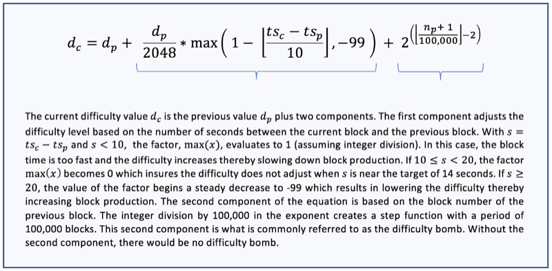
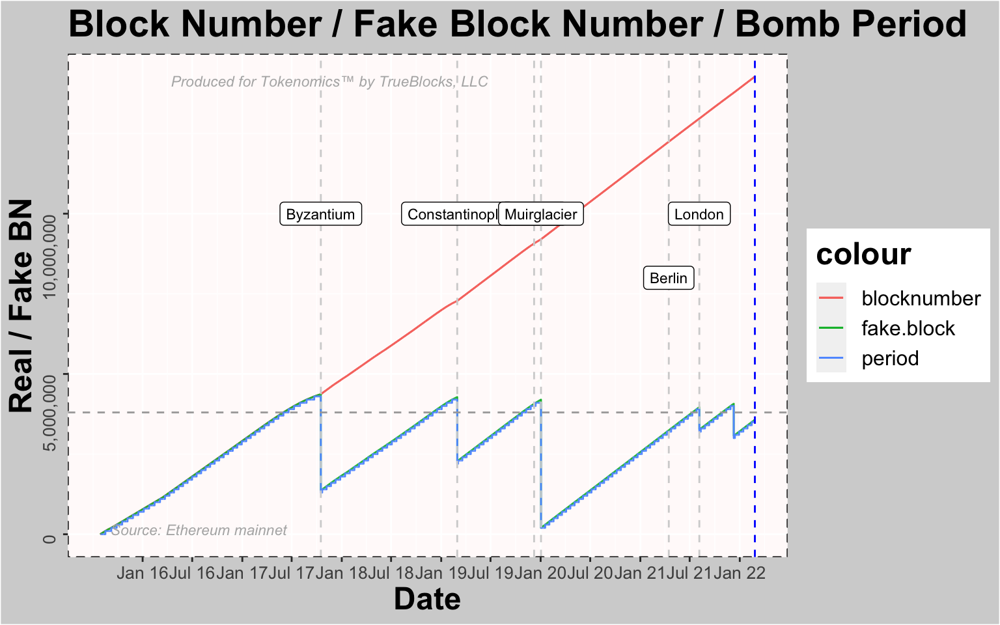
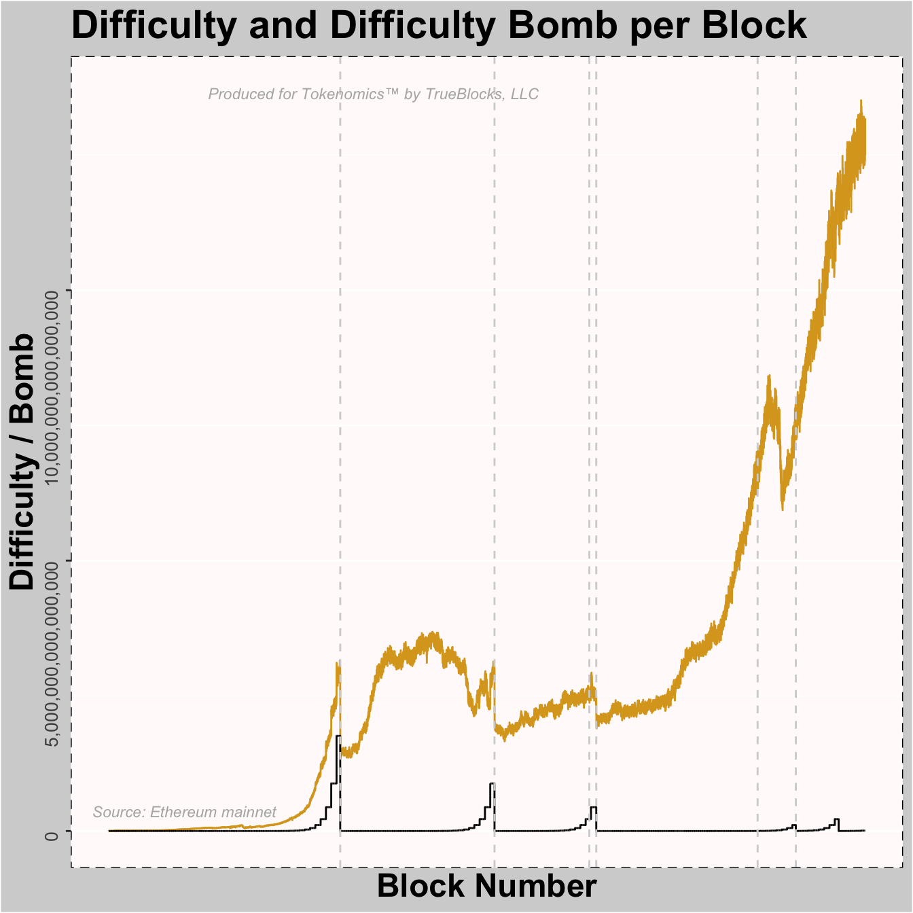
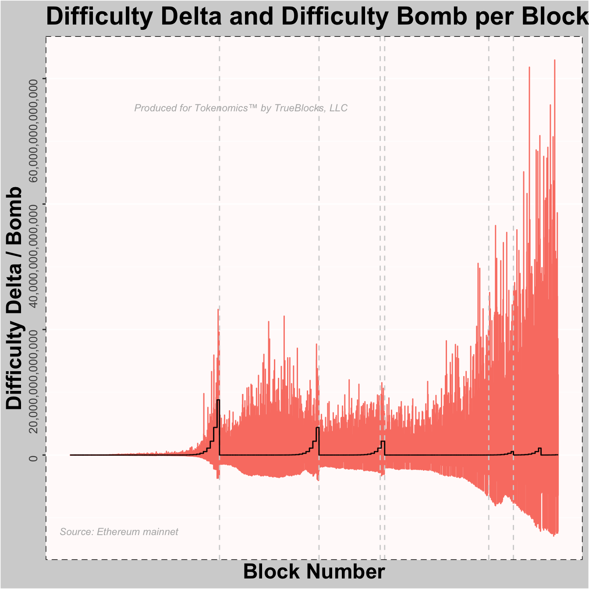
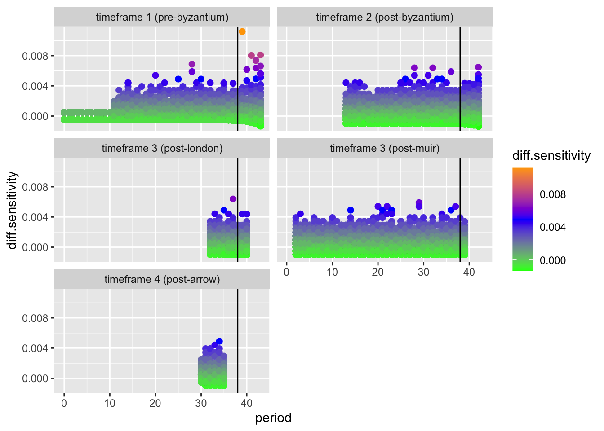
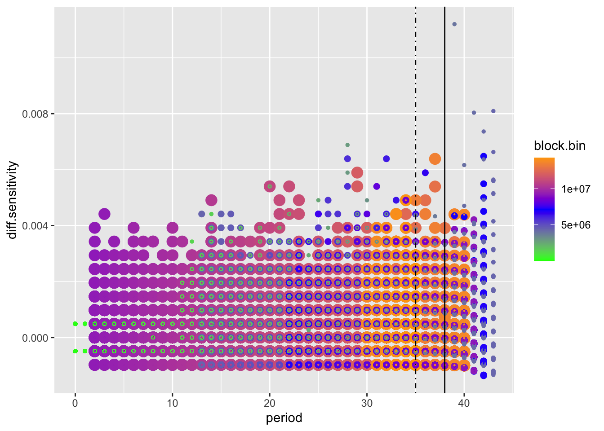
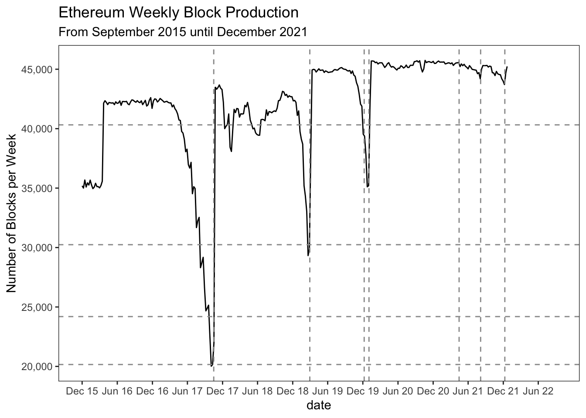
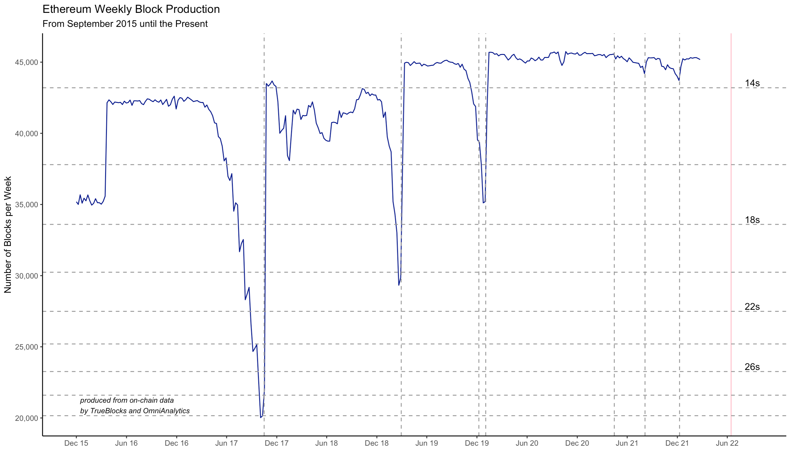

# Ethereum Difficulty Bomb

## INTRODUCTION

Like other cryptocurrency networks, Ethereum relies on a Proof of work consensus mechanism which requires miners to expend energy and computational power, in order to secure the network. This is Ethereum in its current form; however, the shift to Proof of Stake seeks to switch the network over to a validator controlled network where stakes, not hashpower, secure the network. The hope is that it encourages scalability and decentralization of the technology. This change will likely come, but not without some resistance, and it's here where the transition requires a more delecate approach.

Ethereum's "Difficulty Bomb" refers to a mechanism that, at a predefined block number, sharply increases the difficulty of the puzzles in the Proof of Work mining algorithm resulting in longer than normal block times (and thus less ETH rewards for miners). This mechanism increases the difficulty exponentially over time and eventually leads to what is referred to as the "Ice Age" - that is, the chain becomes so difficult to mine that it grinds to a halt and stops producing blocks (freezes). Why a difficulty bomb? It's simple. It's main intent is to exponentially increase the amount of time it takes to mine a new block on the Ethereum blockchain such that it:

1. Encourages crypto miners to move away from energy-intensive PoW mining by removing the incentives.
2. Takes away (hopefully) the ability to capture an over sized influence over the blockchain.
3. Discourages blockchain forks.
4. Forces node operators to upgrade to the latest software.
        
## AIM OF ANALYZING THE DIFFICULTY BLOCK

In his article, "Adventure in Difficulty Bombing", Thomas Jay Rush (tjayrush) performed an exercise in predicting the effect of EIP4345. The main goal of this analysis is to:

1. Double check the current estimation procedure to unearth inconsistencies, if any.
2. Return and possibly optimize their outputs so that the intuitiveness of the graphs are improved.
3. Provide an intuitive interpretation of the results and when the bomb is expected to blow next.

To this end, we reviewed Thomas's code to create the follow expostulation of Ethereum's next diffculty bomb.  In his aforementioned text, Thomas previously derived two parts to the difficulty calculation based on another article, "It's not that Difficult". In that article, he refers to Part (A) for adjustments and Part (B) for the bomb itself as shown in the diagram below. 

The article opined that the adjustment part, Part (A), is the every-block adjustment that keeps blocks time hovering around 13.5 seconds, and that the bomb part, Part (B), is a step-function that doubles every 100,000 blocks. Further reading can be found here: https://medium.com/coinmonks/adventures-in-difficulty-bombing-837890476630

As pulled from historical on chain data sources, the final dataset (difficulty.csv) consists of > 14 million rows and 3 columns. These columns are listed below:

1. blocknumber
2. timestamp
3. difficulty. 
   
A sample of the raw data within the R-analysis environment is shown in the table below.

## THE DIFFICULTY.R CODE ##

The code section started off with some named blocks, e.g., homestead and byzantium. The full sample_size was set to 50000 (which is a size chosen from the 14,000,000 block sample). The period_size is set at 100,000 while the danger_zone is set to period 38. The "danger zone" is a period Rush identifies where the bomb starts to make its effects known.

Variable names and constants used in the code as below with present time (period) indicated. After the data was read in, pre-processing it involved removing blocks prior to Homestead and creaating additional columns for the visualizaions including: block_bin, block_fake, period, bomb, parent.difficulty, difficulty_sensitivity. 

The first chart in the code indicates the block number / fake block number / bomb period.

The real (actual) block number is indicated with the red line above, with its range from 0 to > 14,000,000. The green line indicates the fake block number which tracks the real block number until it was reset at the Byzantium hard fork. It then parallels to the actual block number, until it was reset again at the Constantinople hard fork. Subsequent hard forks reset the difficulty bomb as needed by adjusting the offset between the actual block number and the fake block number.

The second chart indicates the difficulty level and superimposes the difficulty bomb at each block. 

In the charts above, the height of the yellow line depicts the difficulty level of a particular block. Note that rises in the hash rate equate to increasing difficulty. In fact, increasing difficulty is a response to rising hash rate. Note the combined effect of the difficulty bomb and the increase in hash rate both of which will tend to increase the difficulty level. The large increase in the hash rate toward the more recent parts of the chain is, we beleive due to the increase in the USD price of Ether. If the increase of the price of Ether outstrips the increase in the price of energy (as it almost certainly did), more hash rate will be attracted to the chain.

The third chart in the code is the difficulty delta (that is, the increase or decrease of the difficulty level between blocks) again with the difficulty bomb (in black) overlaid for comparison.

The chart above examines the change in difficulty between each successive block, where the growing wild swings in the difficulty delta is a function of the larger hash rate. The difficulty seems to obviously boomerang towards the tail end of the block number with block numbers prior to that showing steady patterns. We see at a particular block number, the difficulty skyrocketed.

The fourth chart in the code indicates the difficulty when aggregated across 100,000 block periods. The views are separated into groups based on which hard fork they were part of (Byzantium, Constantinople, and so forth).

The charts above indicate the difficulty sensitivity per block for pre-byzantium, post-byzantium, post-london, post-muir and post-arrow. Insights from the pre-Byzantium and post-Byzantium sections shows that the bomb begins to explode around period 39 or 40. This is inferred by the changing structure of the graph after the vertical black line which marks the 39th period in each chart. An increasingly sensitive difficulty level (i.e., a level that swing more widely) is indicitave of the bomb perterbing the normally more steady system.

The last chart in the code indicates the above mentioned sensitivity with each epoch laid on top of the others to make comparing them easier.

The chart above indicates the difficulty sensitivity per period. Like the aforementioned charts, it was iterated in at least three different epochs, The dotted black line indicates the current period at the time of this writing (period 31 -- beginning of February 2022). THe solid black line indicates the "danger" zone at period 39. The larger, orange dot in the above chart represent more recent hard forks. Smaller, blue dots are from the earlier hard forks (Byzantium and Constantinople). Looking closely, one notices that the later (orange) dots "bend less" than the earlier dots. This is also the result of a higher hash rate as a system with more hash power will recover faster from the effect of the bomb and, in that sense, be less sensitive.

In an effort to generate a more intuitive understanding of what happens to the hash rate over time we generated a plot of the weekly block production from September 2015 until December 2021. This graph contains indicators for hard forks and the number of expected weekly blocks assuming various per-second block times. During the earlier bomb explosions, we see the both the doubling effect of the bomb as block times plummet and the increasingly ineffective attempt of the system to recover from the bomb with the upward trajectory of the block times after each doubling. One can also clearly see the return to normal block times once the difficulty bomb is reset. We see a clear trend over time that miner activity has steadily increased despite the known migration to proof of stake.

## CONCLUSION

A lot has been discussed in literature about the difficulty bomb, with the articles by Thomas Jay Rush having solid formulation of the effects and timing of the difficulty bomb. After an exhaustive code review iteration, bottom up re-coding of the graphs, we can confidently state the bomb is predicated to go off in June considering the rate of difficulty sensitivity experienced now. In the final graph above, we see that block times have consistently been below 14s per block since 2019. Our expectation is that this will be consistent until the bomb goes off for which we'd see a rather swift deterioration of block times over the subsequent weeks until either a commitment to reset the bomb is made or the full migration to PoS, which has no concept of a difficulty bomb, is implemented.

